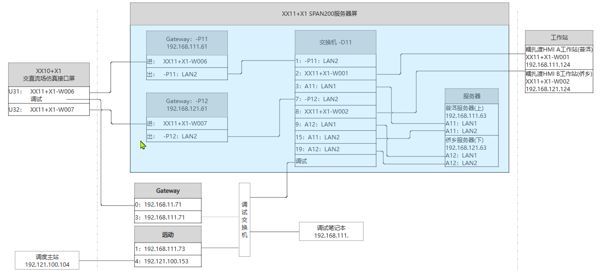

# 南网普洱ADC试验

## 远动装置

- 程序路径
  **前置**
  `/u01/puqiaoADC/fes-run` `./fesmain`
  配置文件路径 `/u01/puqiaoADC/fes-run/fes.config`
  **远动**
  `/u01/puqiaoADC/rci-run` `./server`
  配置文件路径 `/u01/puqiaoADC/rci-run/argument/rci.config`
- HP工作站(糯扎渡HMI A/B工作站)
  192.168.111.124
  192.168.121.124
  密码:CSGTRCGHB201702
## 服务器
- 普洱服务器 192.168.111.63
- 侨乡服务器 192.168.121.63
- 程序路径
  **前置** `/u01/app/fes` `./fes_main`
  **对象** `/u01/app/obj` `./objMgr`
  **历史** `/u01/app/his` `./his_main`
## 试验准备
- 远动客户端rci.exe查看数据是否有效(看时标)
- 后台客户端查看数据是否有效
- 主站、远动、服务器时间要调整一致

